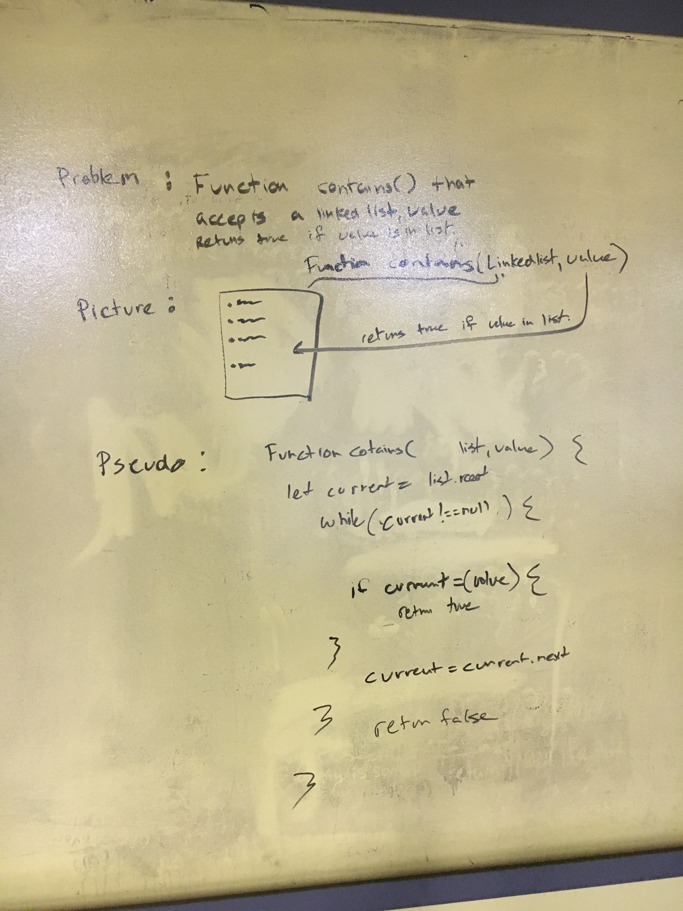
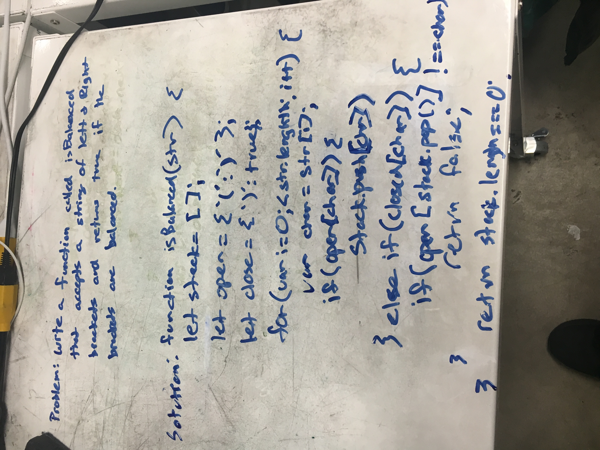
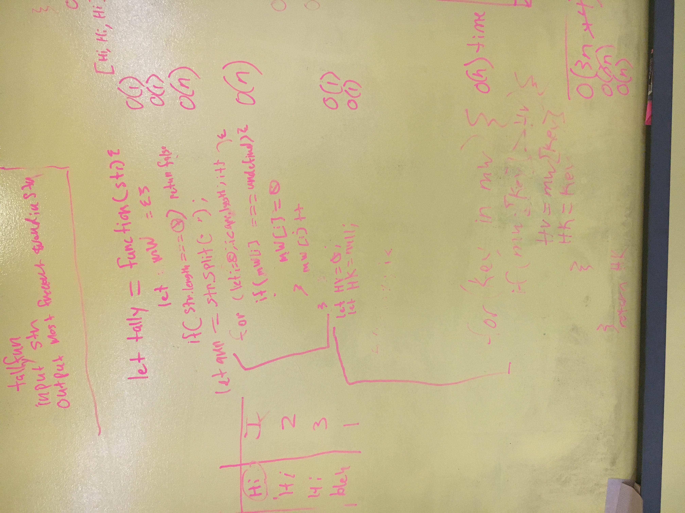
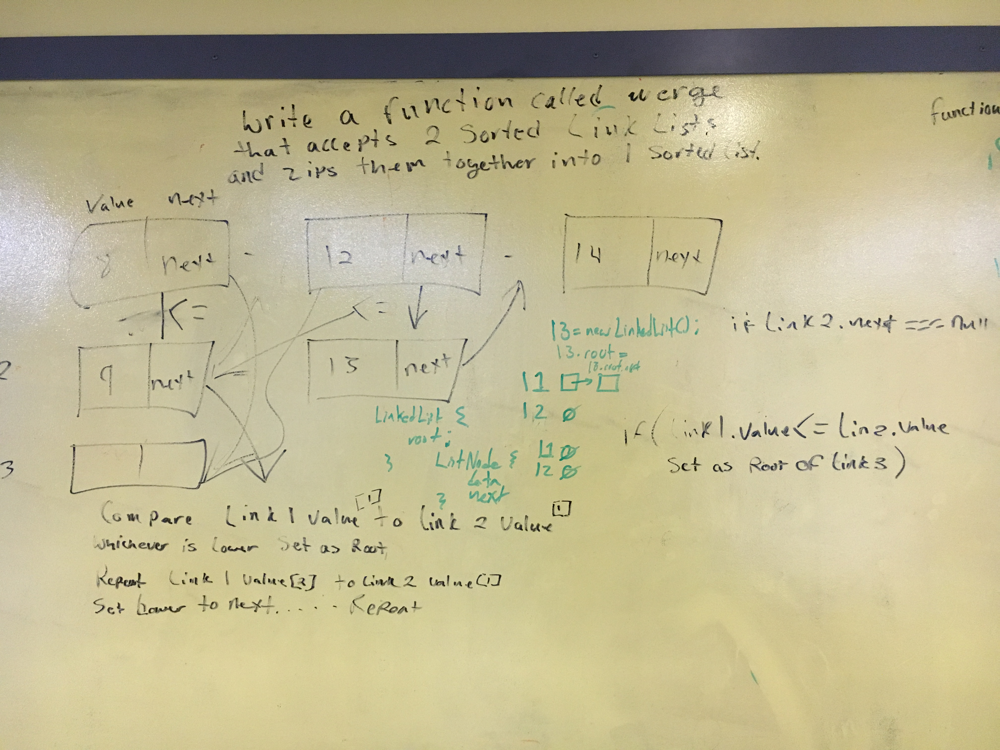
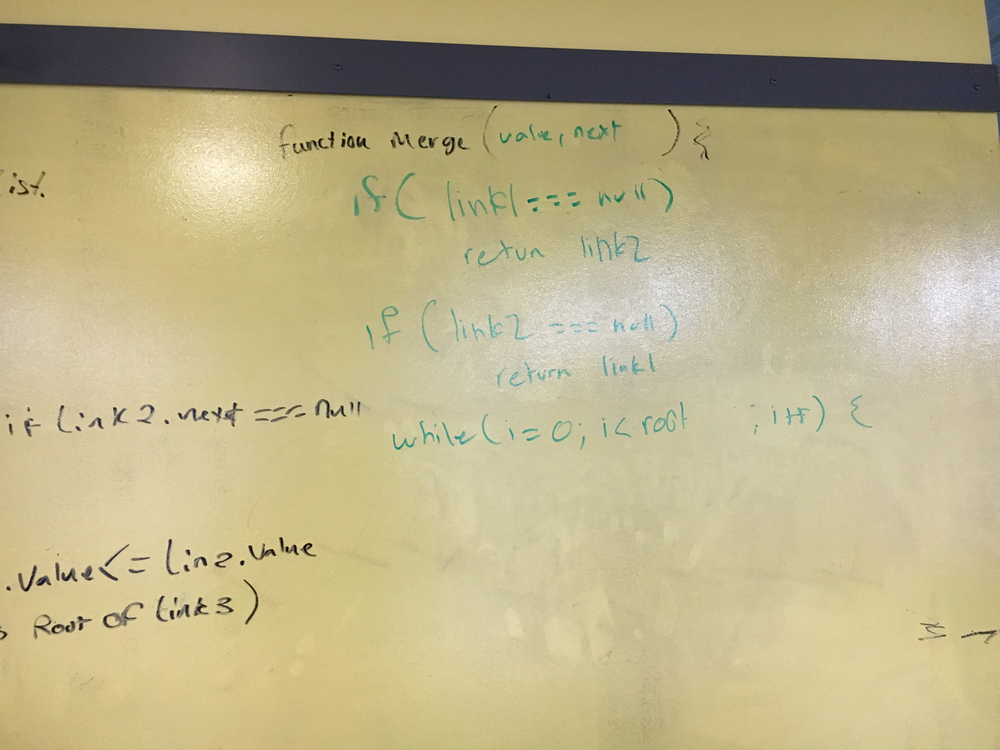

# Brandon Buchholz Code Fellows whiteboard problems:

## Whiteboard Problem 01:

* Write a function called `contains()` that accepts a
linked list and a value. Return true if the value is 
in the linked list.

## Whiteboard Problem 01 picture:

## Whiteboard Problem 01 solution:

* function contains(list, value) {
    let current = list.root
    while(current !== null) {
        if current = (value) {
            return true
        }
        current = current.next
    }
    return false
};

## Whiteboard Problem 02:

* Write a function called isSorted that accepts a linked list as
a parameter and returns true if the linked list is sorted in
ascending order

an empty or single item list should be considered sorted.
because it’s not not sorted.

## Whiteboard Problem 02 picture:

## Whiteboard Problem 02 solution:

* function isSorted(linkedList) {
    let current = list.root
    if(current === null || current.next === null) {
        return true;
    } while (current) {
        if (current.data >= current.next.data) {
            return false;
        }
        current = current.next;
    }
    return true;
}
## Whiteboard Problem 03:

* Write a function called `isBalanced` that accepts a
string of left and right brackets and returns true if
the brackets are balanced.

Use a stack!
Push whenever you see an opening curly brace.
Pop whenever you see a closing curly brace.
If you see a closing curly brace when the stack is empty,
that's an error.

## Whiteboard Problem 03 picture:

## Whiteboard Problem 03 solution:

* function isBalanced(str) {
    let stack = [];
    let open = { '{': '}' };
    let closed = { '}': true };
    for (var i = 0; i < str.length; i++) {
        let char = str[i];
        if (open[char]) {
            stack.push[char]
        } else if (closed[char]) {
            if (open[stack.pop()] !== char)
             return false;
        }
    }
    return stack.length === 0;
};
## Whiteboard Problem 04:

* Write a function called tally that accepts a string and returns the most frequently used word in the string.

Assume the string your given is all lowercase, contains no punctuation and each word is seperated by exactly one space.

If you were given good input for the last verse of The Twelve Days of Christmas your function should return "a" because "a" is the word that appears the most in this verse:

## Whiteboard Problem 04 picture:

## Whiteboard Problem 04 solution:

* let tally = function (str {
    let mw = {};
    let hv = 0;
    let hk = null;
    if (str.length === 0 ) return false
    let arr = str.split(" ");
    for (let i = 0; i < app.length; i++){
        if (mw[i] === undefined) {
            mw[i] = 0;
        }
            mw[i]++
    }
    for( key in mw) {
        if( mw[key]> hv) {
            hv = mw[key];
            hk = key;
        }
    } 
    return hk;
});

## Whiteboard Problem 05:

* Write a function called merge that accepts two sorted Linked Lists and zips them together into one sorted Linked List.

Be sure to draw pictures on the whiteboard to represent example input. Use psuedo code to engineer any particularly tricky pieces of code.

Given:

8 -> 12 -> 14
9 -> 13

## Whiteboard Problem 05 picture:

## Whiteboard Problem 05 solution:

* 
function merge(l1, l2) {
  let result = new LinkedList();

  let c1 = l1.root;
  let c2 = l2.root;
  if (c1 === null) {
    result.root = c2;
    return result;
  }
  if (c2 === null) {
    result.root = c1;
    return result;
  }

  if (c1.value <= c2.value) {
    result.root = c1;
    c1 = c1.next;
  } else {
    result.root = c2;
    c2 = c2.next;
  }

  let last = result.root;
  while (c1 !== null && c2 !== null) {
    if (c1.value < c2.value) {
      last.next = c1;
      c1 = c1.next;
    } else {
      last.next = c2;
      c2 = c2.next;
    }
    last = last.next;
  }

  if (c1 !== null) {
    last.next = c1;
  }

  if (c2 !== null) {
    last.next = c2;
  }
  return result;
}

## Whiteboard Problem 06:

* Write a function called `reverse` that takes one integer as a parameter. Return a new integer with all the digits reversed. Only use common math operations like `+*/%`. You may use `Math.floor` to help with rounding.
Do not arrays. Do not use strings. You are forbidden. Stay in the land of numbers.

ex.reverseInt(459); // returns 954

## Whiteboard Problem 06 picture:

## Whiteboard Problem 06 solution:

* function reverse (integer) {
    let oldNumber = integer;
    let newNumber = 0;
    while (oldNumber !== 0) {
        let remainder = oldNumber % 10;
        newNumber = newNumber * 10 + remainder;
        oldNumber = math.floor(oldNumber / 10);
    }
return newNumber;
};
